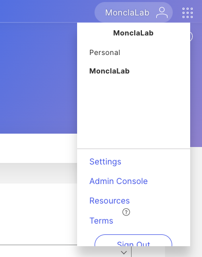
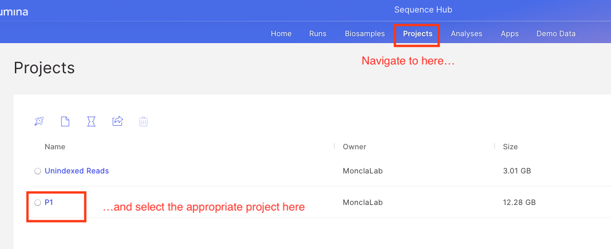
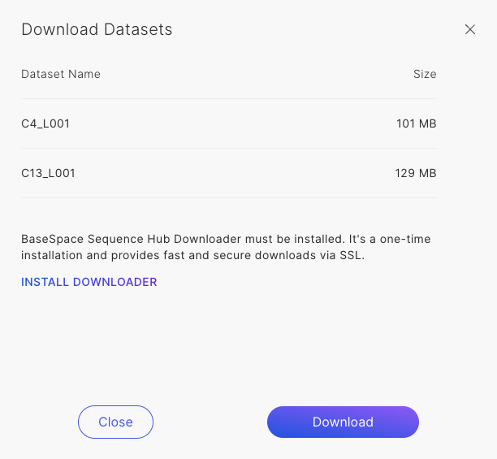
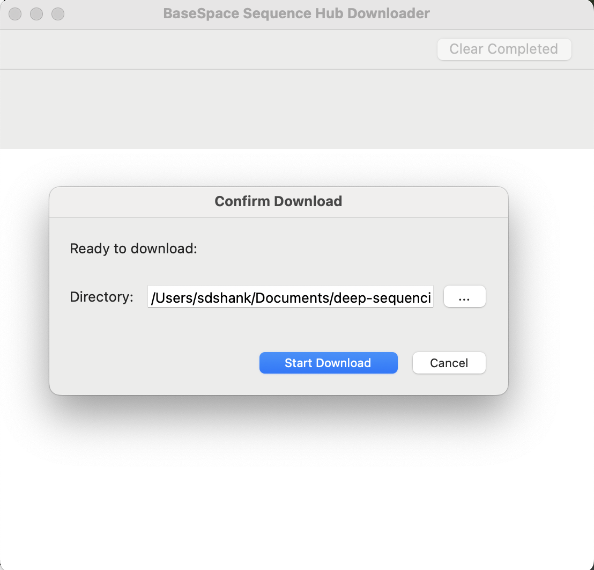
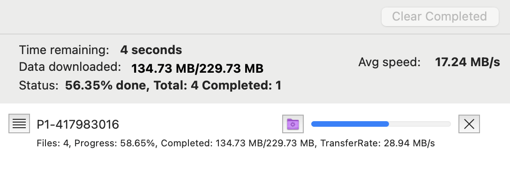

# Moncla Lab Illumina Pipeline Documentation

This document covers a more comprehensive overview of this pipeline.

## Table of Contents

## Table of Contents

1. [**Starting from reads**](#1-starting-from-reads) - Going from data fresh off of Illumina sequences to biological information
2. [**Tools utilized**](#2-tools-utilized) - Bioinformatics tools used in this pipeline with a brief description and rationale.
3. [**Configuration**](#3-configuration) - How the pipeline is configured.
4. [**User stories**](#4-user-stories) - Various use cases for this pipeline and how to execute them.
5. [**Output produced**](#5-output-produced) - The various files that are produced by this pipeline.

## 1. Starting from reads

At this stage, we assume the lab technicians have done their part of the process and sequenced a few samples. There's raw read data available in Illumina Basespace waiting to be analyzed. It's now on the informatician to continue the work, and extract some information from this data. Begin by logging into BaseSpace and sure that you're associated to the correct group:

Navigate to projects and select the appropriate one...

Navigate to FASTQs, and select the IDs that you intend to analyze...

Go back up to the file icon and select dataset from the following dropdown...

You'll be prompted with the files that you're going to download. You will need Illumina Basespace downloader to be installed on your local machine if you haven't already. Also, one quirk I've found is that this program needs to be open for me. The web application can start a download in the program if it's already open, but if it's not, it can't open it for you.

Click download to proceed...

Select the folder where you'd like your sequences locally, then click start download...

If you've made it this far, and see the download in action as below, congratulations! You have completed the first step of informatics: get the data!

You can now refer back to the [README](https://github.com/moncla-lab/illumina-pipeline/blob/main/README.md) for how to set up and do a first run. Just remember the directory that you used above, as that will need to go into the configuration file for the repository.

## 2. Tools utilized

TODO: give a better description of the overall flow, but at this point it's [Snakemake](https://snakemake.readthedocs.io/en/stable/), [Bioconda](https://bioconda.github.io/), [Genbank records](https://www.ncbi.nlm.nih.gov/genbank/samplerecord/), [GTF format](https://genome.ucsc.edu/FAQ/FAQformat.html#format4), [Trimmomatic](https://academic.oup.com/bioinformatics/article/30/15/2114/2390096), [Bowtie2](https://www.nature.com/articles/nmeth.1923), [SAMtools](https://academic.oup.com/bioinformatics/article/25/16/2078/204688), [VarScan](https://genome.cshlp.org/content/22/3/568.short), [BEDTools](https://academic.oup.com/bioinformatics/article/26/6/841/244688),[SeqKit](https://journals.plos.org/plosone/article?id=10.1371/journal.pone.0163962), [MultiQC](https://academic.oup.com/bioinformatics/article/32/19/3047/2196507), [NCBI E-utilities](https://www.ncbi.nlm.nih.gov/books/NBK25501/), and [Bash](https://www.gnu.org/software/bash/).

## 3. Configuration

We use YAML (a practice recommended by Snakemake) to configure both tools and rules. Configurations that are specific to tools will begin with the `tool_` prefix, whereas configurations that are specific to rules will begin with the `rule_` prefix. See `config.yml` at the root of the repository, which contains our recommended default parameters. Since the same tool can be used across many rules, we generally start by associating configurable parameters to a **tool** that will occur across all rules it is used in. There are of course instances (such as minimum coverage in consensus vs. variant calling) where we'll wish these to be more **rule** specific. This is the rationale behind using the prefixes, so that understanding this design principle will hopefully allow a user to understand exactly what is taking place after a cursory glance at the configuration file. You may certainly wish to customize these depending on the nuances of the analysis that you are trying to perform.

### Description of individual configuration parameters

- `reference` - Determines what is used as the reference.  Works with multi-segmented viruses like influenza. See `references.tsv` for the exact accessions that are use, as well as the `fetch_reference_data` rule.

- `data_root_directory` - Where the data from BaseSpace has been exported to (refer back to [starting from reads](#1-starting-from-reads) if necessary). This pipeline has functionality (in `mlip.dataflow.situate_basespace_data`) to seamlessly move data out of the unwieldy format provided by default into a much cleaner format in this pipeline for ingestion.

## 4. User stories

TODO: write these up in more detail and confirm acceptability with Louise. Right now there's some functionality for individual samples:

as well as 

## 5. Output produced

TODO: write this up along with a description of each format